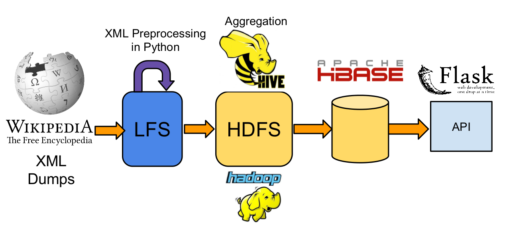

Wikihub
=======


### Building a portal to provide Github-like stats for Wikipedia Pages.

*N.B.: Wikihub is still in alpha. While the AWS cluster is up the app is available at [http://wikihub.info/](http://wikihub.info/)*

Wikipedia is an amazing tool, but it is sometimes difficult to assess how active a page is or to find statistics on edits. [Wikihub](http://wikihub.info/) aims at providing painless access to summary statistics and edits timeseries.

## Data Pipeline


The latest [Wikipedia XML dumps](http://dumps.wikimedia.org/enwiki/latest/) are downloaded from the Wikipedia Servers via a [shell script](data_scripts/download_wiki_dumps.sh). Preprocessing is done in [Python](data_scripts/xml2tsvgzip.py) with minimal memory footprint (SAX parser) for conversion to TSV.

The files are then put into HDFS for [aggregation in Hive](batch_processing/hive/). Data is then inserted into Hbase through bulk loading using importtsv.

A Flask API serves API requests offering statistics on a per page basis.


### Additional setup requirements

The current setup was done on an Ubuntu 12.04 LTS AMI on AWS in a cluster comprised of one m1.large and 3 m1.medium. If I were to do it again, I would provision an m1.xlarge for the Namenode+Hbase Master and make sure I have a secondary Hbase master on a server at least equivalent to m1.large (RAM >= 7.5 Gb), just in case.

The webserver need not be on the same node as the Namenode, it just requires setting up the connection to the correct address in Happybase which can be done in [helpers.py](webapp/app/helpers.py)

####Software

```Shell
sudo apt-get install python-pip
sudo pip install --upgrade pip
sudo pip install --upgrade virtualenv
```

There is a script in the webapp folder to setup the virtual envinronment for the Flask app.